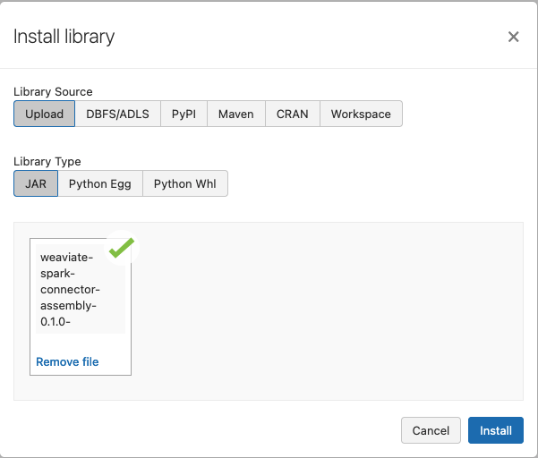
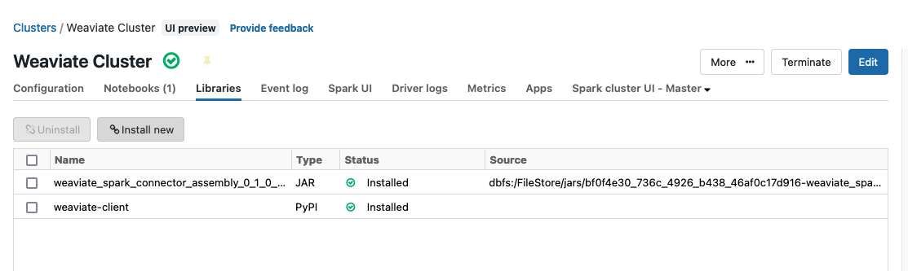

# Weaviate Spark Connector
For use in Spark ETLs to populate a Weaviate vector database.

## Usage
With this package loading data from Spark is as easy as this!

```python
(
    my_df
    .write
    .format("io.weaviate.spark.Weaviate")
    .option("scheme", "http")
    .option("host", weaviate_host)
    .option("className", "MyClass")
    .mode("append")
    .save()
)
```

If you already have vectors available in your dataframe you can easily supply them with the vector option.
```python
(
    my_df
    .write
    .format("io.weaviate.spark.Weaviate")
    .option("scheme", "http")
    .option("host", weaviate_host)
    .option("className", "MyClass")
    .option("vector", vector_column_name)
    .mode("append")
    .save()
)
```

By default the Weaviate client will create document IDs for you for new documents but if you already have IDs you
can also supply those in the dataframe.
If you already have vectors available in your dataframe you can easily supply them with the vector option.
```python
(
    my_df
    .write
    .format("io.weaviate.spark.Weaviate")
    .option("scheme", "http")
    .option("host", weaviate_host)
    .option("className", "MyClass")
    .option("id", id_column_name)
    .mode("append")
    .save()
)
```

### Write Modes
Currently only the append write mode is supported. We do not yet support upsert or 
error if exists write semantics.

Currently only batch operations are supported. We do not yet support streaming writes.

## Installing in Spark
### Install from Maven Central Repositor
COMING SOON
### Install Manually
To use in your own Spark job you will first need to build the fat jar of the package by running
`sbt assembly` which will create the artifact in `./target/scala-2.12/weaviate-spark-connector-assembly-0.1.0-SNAPSHOT.jar`.

You will need to then start your Spark job with the jar. This can be done via spark-submit with the `--jars` option.

To run on Databricks simply upload the jar file to your cluster in the libraries tab as in the below image.

After installation your cluster page should look something like this.


## Developer
### Compiling
This repository uses [SBT](https://www.scala-sbt.org/) to compile the code. SBT can be installed on MacOS
following the instructions [here](https://www.scala-sbt.org/1.x/docs/Setup.html).

You will also need Java 8+ and Scala 2.12 installed. The easiest way to get everything set up is to install IntelliJ.

To compile the package simply run `sbt compile` to ensure that you have everything needed to run the Spark connector.

### Running the Tests
The unit and integration tests can be run via `sbt test`. 

The integration tests stand up a local Weaviate instance running in docker and then run the 
Apache Spark code in a separate docker container. You will need to have docker running to run all tests.


## Trying it out Locally in Docker
```
sbt assembly
docker build -t spark-with-weaviate .
docker run -it spark-with-weaviate /opt/spark/bin/spark-shell
case class Article (title: String, content: String)
val articles = Seq( Article("Sam", "Sam"))
val ds = articles.toDF
ds.write.format("io.weaviate.spark.Weaviate").mode("append").save()
```
